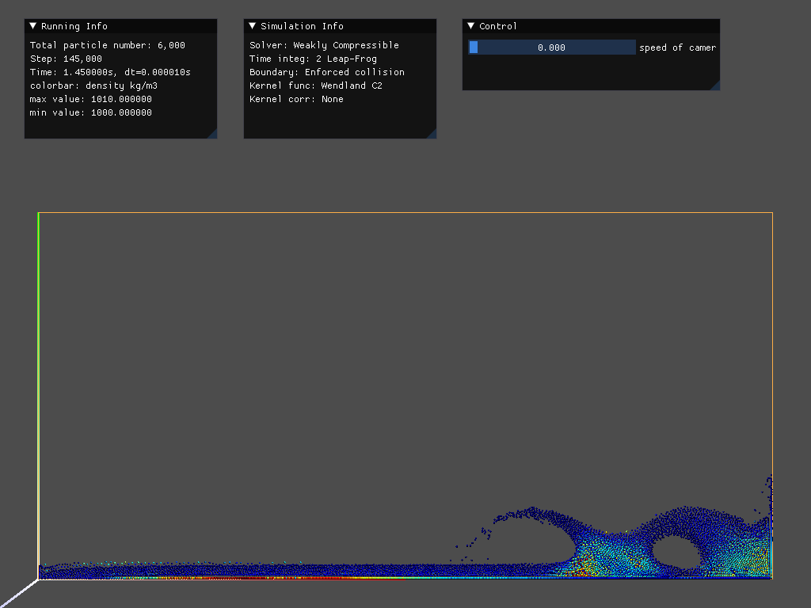
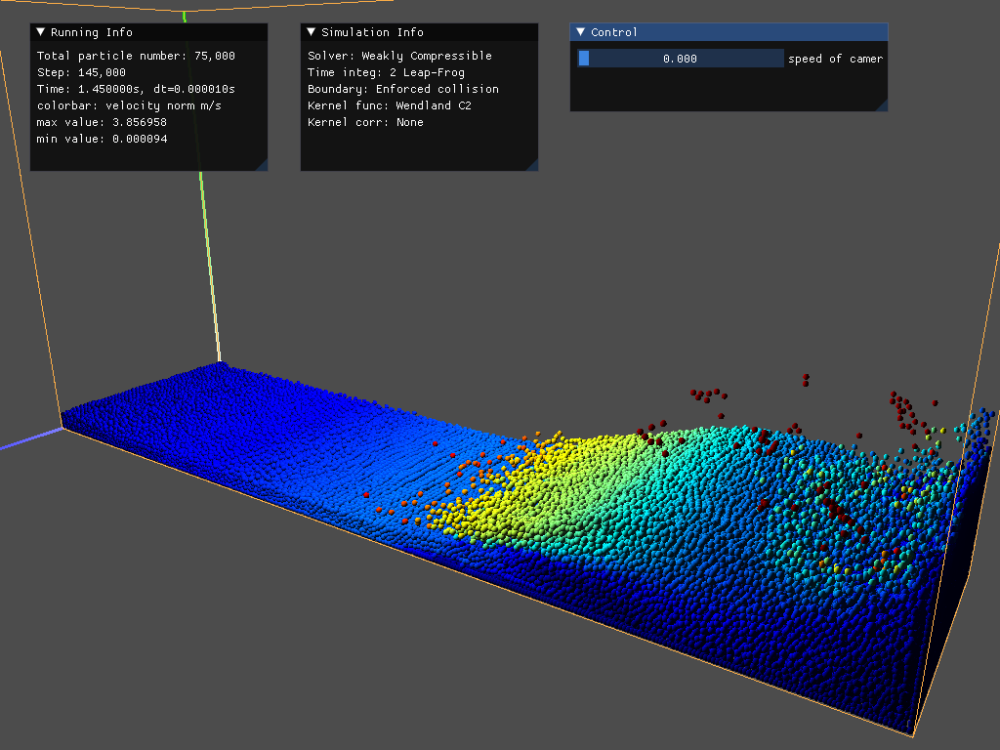
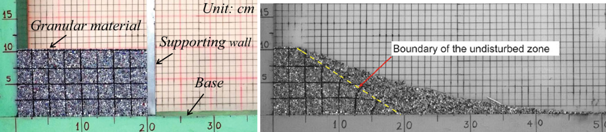
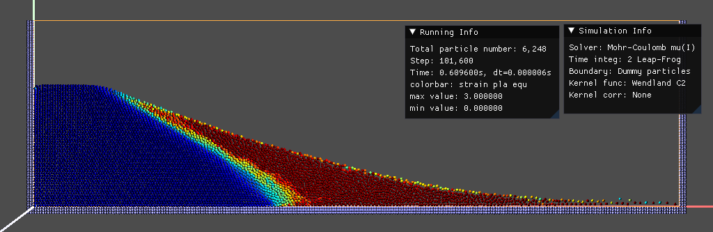
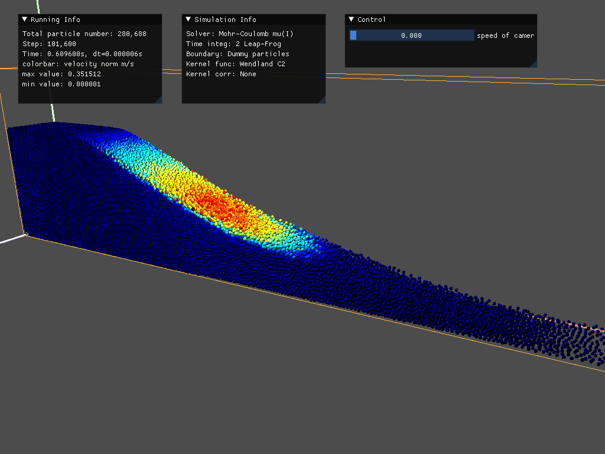
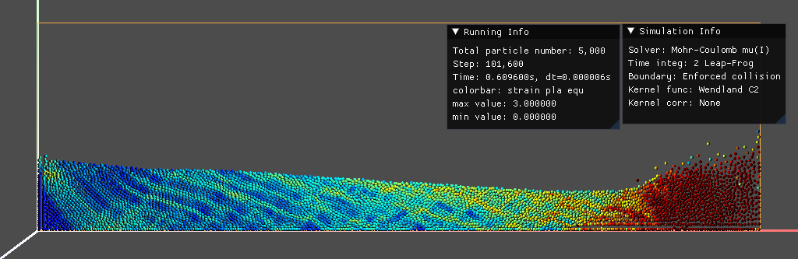
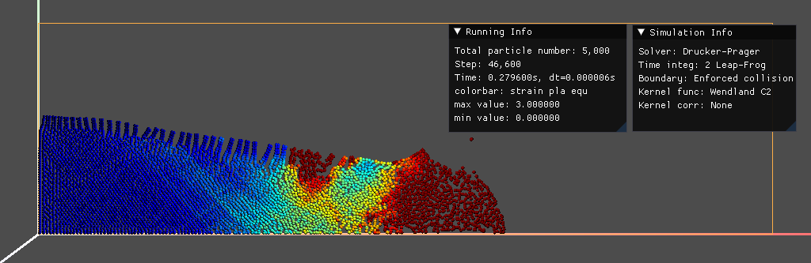
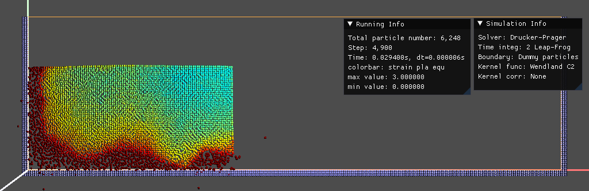
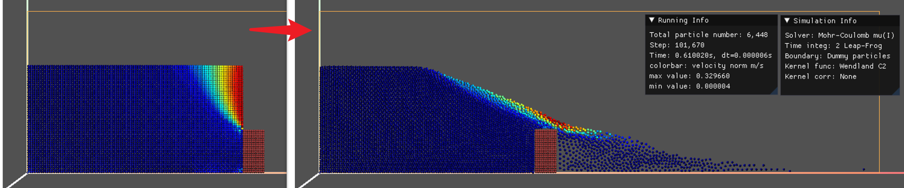
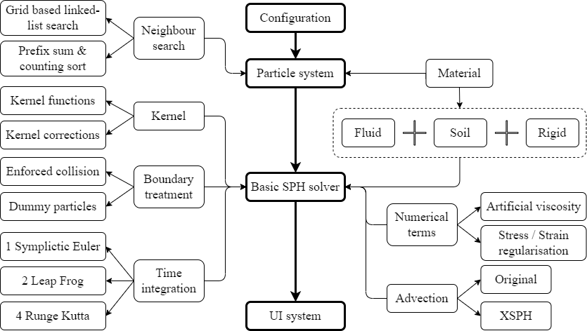

# Taichi_Hackathon_2022
For attending Taichi Hackathon 2022

# 团队名 - JaGut

Ja Gut, 读作 [*呀，故特*], 意为："是的很好！"，来自德语。

# 项目名 - tiSPHi提升计划

# 项目介绍

**tiSPHi：一个准确、稳定、快速、可拓展的流固耦合SPH模拟器。**

（可自由发挥）比如灵感来源、创作背景、想要完成的功能/优化的方向、期望达到的效果、如何去实现、问题的拆解等。

## 代码现状

已经基于SPH_Taichi改写出了自己的框架，并填充了基本代码，能够达到一些效果：

1. water dambreak
   * 在强制碰撞的边界条件下2/3维程序均可运行，但边界附近粒子存在粘度大以及冲击导致空洞等问题
   * 在dummy particle边界条件下粒子会穿透边界或吞粒子
   * 2维和3维程序同参数下运行结果差异较大
   * 流体粘度贡献比预期要大（一般粘度都是0.01如SPlisHSPlasH，我使用0.001才能达到类似的效果）
   * 压力分布不平滑（应主要是由边界条件导致），密度变化率的计算存在问题（负变化率结果很明显，需要强制让密度不小于初始密度）

Fig. Water dambreak at 1.45s, 2D colored by density and 3D colored by velocity, you can find different behaviours and bad pressure distribution.

2. sand column collapse - μ(I)流变本构
   * 在强制碰撞边界条件和dummy particle边界条件下、2/3维程序均可运行

Fig. 模拟二维情况的铝棒塌落试验及结果

Fig. 2维下的模拟结果(等效塑性应变着色)

Fig. 3维下的模拟结果(速度着色)

Fig. 强制碰撞边界条件下，边界摩擦太弱，结果错误(等效塑性应变着色)

3. sand column collapse - Drucker-Prager弹塑性本构
   * 目前只能在强制碰撞边界条件下运行
   * 且还是会爆炸，并不会运行到静止

Fig. 强制碰撞边界条件下，运行中会出现不希望的粘性，且张拉不稳定现象明显；运行至0.28s后爆炸(等效塑性应变着色)

Fig. 虚粒子边界条件下，运行就爆炸，表明边界附近粒子与虚粒子的相互作用出现明显问题(等效塑性应变着色)

4. fluid-solid coupling
   * static rigid body下尚可运行，但是粒子好似体积变大，堆积会变得松弛
   * dynamic rigid body下还存在穿透问题.

Fig. 二维静态阻挡下的塌落，阻挡物后堆积松散，且有一个例子飞出很远(速度着色)

5. UI系统
   * 可根据不同的粒子属性绘制颜色，但暂时无法在运行过程中切换绘制
   * 运行控制-相机位置、启动/暂停、按步暂停、按时间暂停、截图输出、导出截图

**重要问题**
1. 模拟速度慢！使用2阶跳蛙法时间积分，同分辨率，μ(I)本构，arch=ti.cuda，RTX3060 Laptop GPU + AMD R7 5800H，每百步保存截图：
	* 2D, 5k real particles + 1248 dummy particles, 100k steps, 15min
	* 3D, 125k real particles + 155k dummy particles, 100k steps, 610min
2. 边界粒子处理有问题！边界虚粒子和固体粒子与流体粒子的作用需大力修正。
3. 已将不同的时间积分方法与计算模型分离，但还需验证代码中是否存在问题。

## 期望效果

期望实现的代码框架(目前并没有全部实现或正确实现)：

重点问题解决顺序：
1. 尝试多种论文里的方案，实现良好的dummy particle和real particle的相互作用，在尽量少的人工项下实现相对正确且无穿透的结果
2. 解决D-P弹塑性本构的问题
3. 实现沙/水与静/动刚体的耦合
4. 提高计算速度

# 参考

1. 之前开发的 [tiSPHi](https://github.com/Rabmelon/tiSPHi) 老库（旧的代码和文档，久未更新）
2. [SPH_Taichi](https://github.com/erizmr/SPH_Taichi) by 张铭睿
3. 程序相关的一些信息可参考[tiSPHi](https://rabmelon.github.io/tiSPHi/)文档主页
